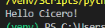

# Overview

This program says hello to Cicero the Roman.

# Development Environment

* Visual Studio Code
* Python 3.8.5

# Execution

To execute the program: `python hello.py`



```python
x = 5
y = x + 1
print(y)
```

# Useful Websites

* [Python Documentation](https://docs.python.org/3/library/index.html)